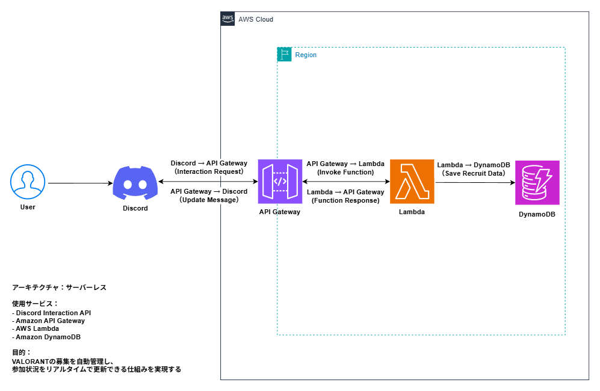

# valo-recruit-bot

AWS Lambda + API Gateway + DynamoDB を使用したサーバーレス構成のDiscord Botです。

Discord上でVALORANTの募集を作成し、参加人数と参加者一覧をリアルタイムで管理できます。

---

## Architecture Diagram

---

## Features

- `/valo` コマンドで募集メッセージを作成
- ボタン操作で参加・取消・募集終了
- 参加人数と参加者一覧をリアルタイム更新
- DynamoDBで募集データを管理

---

## Architecture

Discord  
↓  
API Gateway  
↓  
AWS Lambda  
↓  
DynamoDB  

---

## Tech Stack

- AWS Lambda
- API Gateway
- DynamoDB
- Discord Interaction API
- Node.js
- PowerShell

---

## Purpose

DiscordでのVALORANT募集において、

- 参加人数が分からない
- 誰が参加しているか分からない
- あと何人募集できるか分からない

という課題を解決するために作成しました。

---

## Security Notes

Bot Token や AWSキーは GitHub に公開しないでください。
